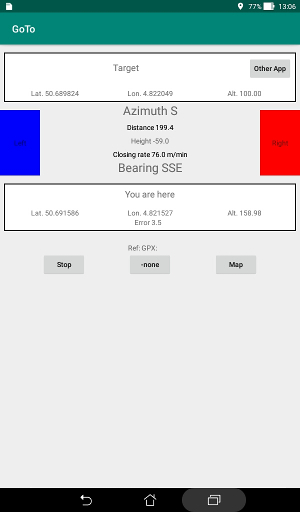
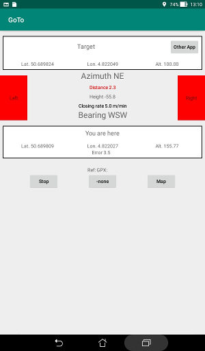

# Main display

This application is displayed only in portrait orientation.

The display is composed of one box at the top (Target box),
another box at the bottom (Here box),  some lines and features
between them and buttons under the Here box.

## Target box

In this box is displayed the location of the destination:
latitude, longitude and altitude (if available).  
The name is also displayed if it is available; otherwise the title
is "Target".

There is a button "**Other app**": this terminates the application
after having submitted to the Android system a request to launch an
application to display this location on a map.  
The target may be too far to reach on foot and one want to use
a guiding application for the car...

## Here box

The current location of the user is displayed in this box:
latitude, longitude and altitude.  
There is also a line giving the status of the GPS receiver.
This line shows the estimated possible error of positioning if there is a good reception.

The position is updated only when there has been a movement of
at least 5 meters.

## Azimuth

Right below the Target box there is a line giving the azimuth of the
destination. The azimuth is the direction relative to the North of
the destination from the current position.  
This is not given in degrees but with a notation similar to the
compass notations: N, NNE, NE, ENE, E, ESE, SE, SSE, S, SSW,
SW, WSW, W, WNW, NW or NNW.

## Bearing

Right above the Here box there is a line giving the travel bearing.
The bearing is the direction of travel relative to the North.  
No magnetic compass is used: the bearing is computed from the displacement
of the previous location to the current location (minimum 5 m distance).  
The notation is like the one for the azimuth.

## Right and Left flag areas

Between the boxes there are on each side flag areas titled "Left" and
"Right".  
They are grayed while the current position is undetermined and
while the bearing is reasonably aligned with the azimuth.

When there is a deviation, one area becomes red (Hot) meaning that the
steps should angle toward this side rather than to the other side that
is blue (Cold).

When the current position is quite near the target (10 m or the GPS error),
the two flag areas are red meaning that it is time to look around.

## More information

Beyond the azimuth and the bearing, there are 3 lines of information:

+ Distance: this is the distance (m) between the current position
and the destination. It has the color red when one is quite near
the destination: less than 10 m or less than the positioning error.
+ Height: this is the difference in altitude from the current position
to the destination. This is not always available.  
A RC plane could be hanged in a tree or down a cliff...
+ Closing rate: the speed of diminishing distance between the
current position and the destination, in meters per minute.  
It is displayed in red if it is negative: moving off instead of coming near.

## Buttons at the bottom

There are 3 buttons under the Here box.

The "**Stop**" button terminates the application.  
If the GPS has been enabled specifically for this application,
the user has the opportunity to disable it.

The "Ref. GPX **-none-**" button and the "**Map**" button are
related to the display of a map. See the explanation about this feature.  
They are disabled if the application Msb2Map is not available.
 
