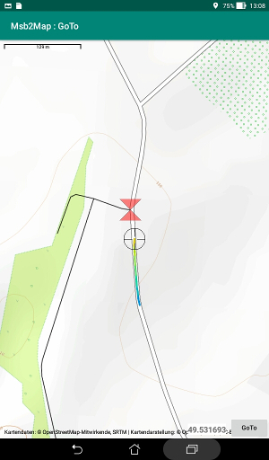

# Map display

A map could be displayed with the help of the application Msb2Map
if it is installed.  
The Internet should have been accessible at some time to fill
the cache of map tiles for the region concerned.  
Please look at the documentation for this application for more details.

The map is not dynamically updated while it is displayed.
The GPS is active only while the main display of the GoTo application
is in the foreground.

## Map

The Msb2Map application is launched when the "**Map**" button is
pushed on the main display.

The location of the destination is marked with a red diabolo.

The last part of the track that has been followed up to now
is drawn as a continuous line. Its color is modulated by the distance
to the destination: blue when the distance is greater than 200 m to red
when at the target, passing by green.  
There is no provision to save the track.

The current position is marked with a reticle and is at the center of
the display.

## Reference GPX

The button "Ref. GPX **-none-**" lets you select a GPX file
in preparation to be displayed before other data on the map.  
This provides an additional information layer.

The waypoints are drawn as magenta color diabolos, the routes and
tracks as magenta color continuous lines.

This could help to indentify features in the landscape.

The [Vtrk)(https://github.com/msb2kml/Vtrk/) application could
have been used to prepare a tailor-made file.

